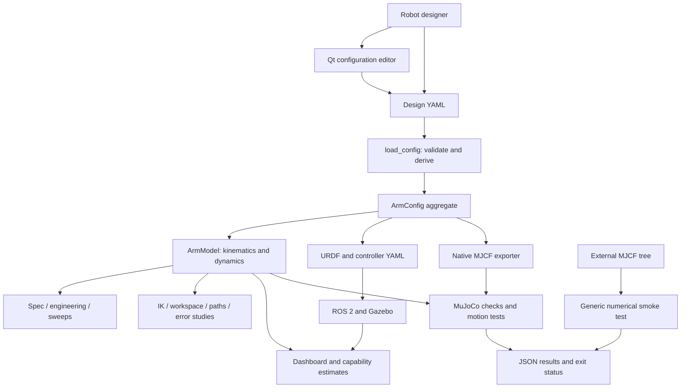
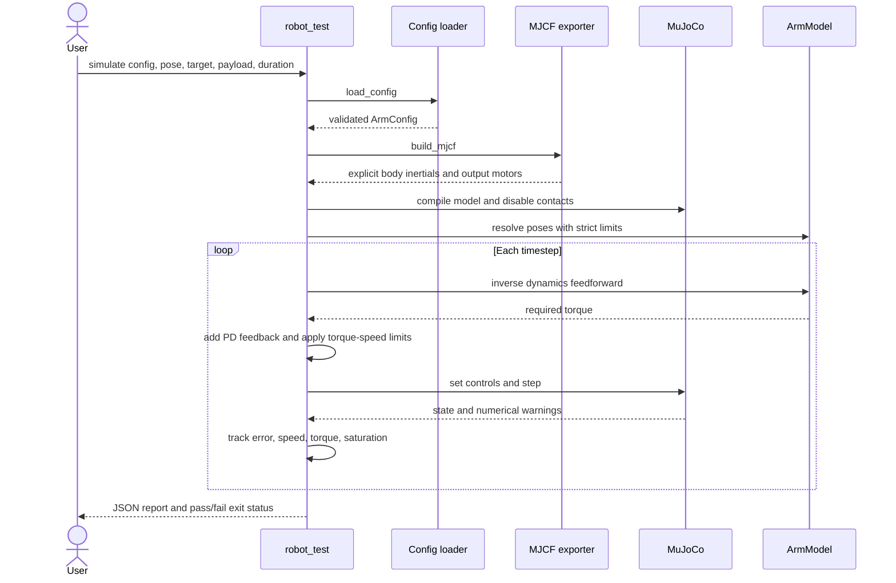

# Architecture and system design

[Documentation index](README.md)

## System context

The design YAML is the persisted input. Python expands it into an in-memory
aggregate, derives physical quantities and generates models for other tools.
There is no database, web service or deployed robot driver in this repository.

<!-- AUTO-GENERATED: diagram:system -->

<!-- END AUTO-GENERATED -->

## Package responsibilities

| Package | Responsibility | Main dependencies |
|---|---|---|
| `arm_lab_model` | Config, rigid-body model, engineering calculations, reports, URDF/controllers, native MuJoCo backend | NumPy, PyYAML; optional MuJoCo and PyKDL |
| `arm_lab_kinematics` | IK, workspace, singularity/collision analysis, accuracy studies, path planning/timing, MoveIt generation; optional ROS motion nodes | `arm_lab_model`; ROS for nodes |
| `arm_lab_gui` | Qt configuration editor, dashboard, live-state interpretation, capability publisher, speed test | Model package, ROS messages/rclpy, Qt binding |
| `arm_lab_bringup` | ROS launch composition, world and RViz assets | Other packages, Gazebo/ROS bridge, ros2_control, RViz |

The model and most planning modules can run without ROS. GUI/node modules import
ROS/Qt at module import time. Documentation extraction uses AST to avoid starting
those modules. MuJoCo is imported lazily when engine execution is requested.

## Three execution paths

### Offline design and analysis

`load_config` resolves materials and actuators, validates supported inputs and
creates `ArmConfig`. `ArmModel` computes frames, kinematics, load torque and
capability estimates. Reports, sweeps and kinematics tools consume these objects.
An analysis result describes that input model; it does not contain simulated
sensor feedback or a controller trace.

### MuJoCo benchmark

`build_mjcf` writes a fixed-base arm directly as MJCF. `crosscheck` compares FK
and inverse dynamics with `ArmModel` at seeded random states. `simulate_arm`
uses an independent forward simulation with a benchmark controller and torque
limits. The tool is rigid and arm benchmark contacts are disabled. Generic
`simulate_mjcf` instead loads an external model and retains its configured
physics; no arm YAML conversion, arm reports or locomotion controller is applied.

<!-- AUTO-GENERATED: diagram:simulation-sequence -->

<!-- END AUTO-GENERATED -->

### ROS/Gazebo runtime

The launch layer generates URDF and controller configuration on disk, starts
Gazebo, publishes robot description, spawns the robot and loads controllers.
Joint states feed transforms and live analysis. The ROS trajectory controller
is distinct from the MuJoCo benchmark controller. See the separate
[runtime graph](ROS_INTERFACES.md).

## Files, state and lifetime

| Artifact | Writer | Consumer / lifetime |
|---|---|---|
| Design YAML | User or configuration editor | Persisted design; load again after editing |
| `ArmConfig` | `load_config` | In-memory aggregate; includes raw YAML and derived objects |
| `FrameSet` | `ArmModel.frames(q)` | State-dependent geometry and inertia at a particular joint vector |
| URDF/controller YAML | Generators and launch helpers | ROS startup; normally under `/tmp/arm_lab_generated` |
| Native MJCF | `robot_test export` or in-memory exporter | MuJoCo; explicit model input |
| JSON test reports | `robot_test` | Saved metrics, identity hashes, scope and verdict |
| Workspace `.npz` | Workspace CLI with `--save` | Workspace marker publisher and offline reuse |
| ROS joint states | Joint-state broadcaster | Live consumers; record with rosbag for reproducibility |

Configuration edits are not a live parameter-update protocol. Reload/rebuild
the model and relaunch when changing geometry or physical simulation properties.
The editor recomputes candidate estimates; an already spawned Gazebo body does
not change when its YAML is edited.

`ArmModel` caches several quantities in its constructor. Do not mutate a loaded
config and assume an existing model will pick up all changes. Reconstruct the
model after changes, and regenerate exports. `FrameSet` must match the exact
configuration and joint state supplied to calculations that reuse it.

## Architectural limits and extension points

The [general pipeline](EXTENDED_PIPELINE.md) uses immutable `ProjectConfig`
composition and explicit body/joint trees. `physical_robot.resolve_robot` derives
STL/material inertials or preserves complete manual values; `robot_export` writes
URDF and MJCF from the same resolved tree. `robot_legacy` adapts existing arm YAML
without changing the old `ArmModel`'s ordered-chain assumptions.

`pipeline_runtime` executes named trajectories and records simulation observations.
`pipeline_moveit` derives group/controller settings; `pipeline.launch.py` composes
robot description, MoveIt, the MuJoCo trajectory action server, RViz, world and
perception nodes. `trajectory_store` owns persistent records; `benchmark_engine`
compares compatible observations and `benchmark_reports` renders evidence-labeled
artifacts. See [the integrated workflow](PIPELINE_WORKFLOW.md).

Fixed/floating bases, multiple branches and end effectors are supported in this
pipeline. Floating-base contact simulation does not provide locomotion control.
The arm editor and engineering sizing reports retain serial-arm assumptions.
SLAM, semantic recognition and learned policies require external algorithms;
perception supplies integration boundaries and a simple color-region baseline.

The native exporter and analytical dynamics share physical input values. Their
agreement tests equation implementation and model conversion, not independence
of the assumed masses or friction coefficients. Independent measurements remain
necessary for hardware fidelity.

Source: [configuration](../src/arm_lab_model/arm_lab_model/config.py),
[dynamics](../src/arm_lab_model/arm_lab_model/kinematics.py),
[MuJoCo backend](../src/arm_lab_model/arm_lab_model/mujoco_backend.py),
[launch helpers](../src/arm_lab_bringup/launch/common.py).
