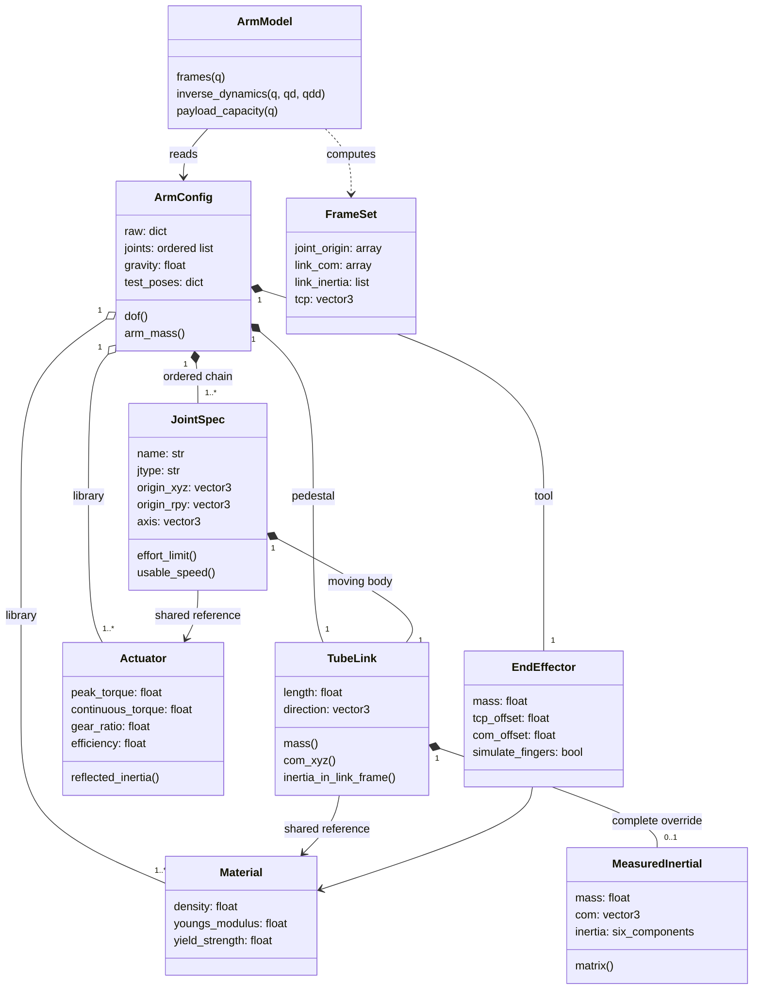

# Domain models and invariants

[Documentation index](README.md) · [Generated field/type reference](API_REFERENCE.md)

## Design aggregate

The domain model is a collection of Python dataclasses and calculation objects.
The diagram shows actual types; methods representing Python properties are
drawn as operations for readability. Multiplicities describe a usable loaded
arm, not a database schema. There are no ORM entities or database migrations.

<!-- AUTO-GENERATED: diagram:domain -->



<!-- END AUTO-GENERATED -->

## Entity semantics

| Type | Meaning and ownership |
|---|---|
| `ArmConfig` | Aggregate containing raw input, source path, mounting, libraries, ordered joints, pedestal, tool, environment, control and test targets |
| `Material` | Shared library entry with density, Young's modulus, yield strength and color |
| `Actuator` | Shared library entry with motor-side ratings, transmission, output losses, electrical/thermal and feedback assumptions |
| `JointSpec` | One rotary degree of freedom, its transform, limits, actuator reference and moving link |
| `TubeLink` | Collision/structural tube geometry and default tube-plus-lumped-mass model; optional measured inertial override |
| `MeasuredInertial` | Complete moving assembly mass, 3D CoM and full tensor about that CoM |
| `EndEffector` | Entire tool, TCP and CoM offsets, rigid-body dimensions and optional Gazebo jaw properties |
| `ArmModel` | Derived calculation service constructed from a config; caches limits, inertias and frame constants |
| `FrameSet` | World-frame joint origins/axes, body CoMs/inertias, distal points and TCP at one joint configuration |

Two joints selecting the same actuator name reference the same `Actuator`
object. An actuator-library edit affects every selecting joint after reloading.
The same sharing applies to materials. `JointSpec.link` and an optional measured
inertial belong to that joint; the pedestal is a separate fixed `TubeLink`.

## Coordinate and unit contracts

| Quantity | Contract |
|---|---|
| `q`, `qd`, `qdd` | One component per arm joint in configuration order; rad, rad/s, rad/s² |
| `origin_xyz` | Translation expressed in the preceding link frame, applied at its distal point |
| `origin_rpy` | Fixed joint-frame roll/pitch/yaw after translating; radians |
| `axis` | Joint rotation axis expressed in the joint frame; loader normalizes it |
| `link.direction` | Tube direction in the moving link frame; loader normalizes it |
| `inertial.com` | Complete assembly CoM in link coordinates, measured from the proximal origin |
| `inertial.inertia` | `[ixx, iyy, izz, ixy, ixz, iyz]`; tensor about CoM, expressed in link axes, kg·m² |
| `FrameSet.link_inertia` | CoM tensors rotated into world axes for the current state |
| TCP | End point offset from the last link's distal point along its link direction |
| Gravity | Nonnegative magnitude; model uses world vector `[0, 0, -g]` |

For joint i, translate from the previous distal point using the previous frame,
then apply `origin_rpy`, then rotate about `axis` by `q[i]`. Transform the CoM
with the resulting link frame. Advance by `direction * length` to obtain the
next distal point. This order is important when offsets and rotations coexist.

## Derived versus measured mass properties

Without an override:

```text
link mass = tube density × cross-sectional area × length
            + assigned actuator mass + extra_mass
```

The tube is uniform; actuator/fitting mass is approximated near its proximal end.
The default CoM and inertia follow the composite-body calculation. With
`link.inertial`, the supplied mass/CoM/tensor replaces that complete assembly.
Do not add the actuator again. Geometry, material and tube stiffness remain
active, so structural estimates can still be approximate even with accurate
mass properties. `tube_mass` remains a geometry estimate, not the measured total.

The public full-tensor interface is `com_xyz` plus `inertia_in_link_frame()`.
The older `com_distance`/`inertia_about_com()` helpers implement tube calculations;
do not use them to read arbitrary measured tensors or off-axis CoMs.

## Actuator submodels

`ActuatorElectrical` maps torque to current and estimates torque-speed envelopes
and copper losses. `ActuatorThermal` models one thermal resistance/capacitance
and temperature limit. `ActuatorModel` combines those into holding and duty-cycle
estimates; `ThermalVerdict` records the outcome. These are calculations, not
separate dynamic motor/controller states in Gazebo.

`BusTiming`, `BusVerdict`, `ContactVerdict` and `HoldingVerdict` describe timing,
supply, sensing and power-loss estimates. `BucklingResult`, `FatigueResult` and
`BearingLife` summarize structural screening. Input values and validity of the
underlying assumptions determine the usefulness of those results.

## State, planning and result models

| Object | Role |
|---|---|
| `LiveState` | Aligns joint names to config order, estimates acceleration, combines live state with model-derived metrics |
| `IKResult` | Candidate solution with convergence/error information; inspect success before commanding it |
| `WorkspaceMap` | Sampled workspace occupancy/orientation capability; finite sampling is not an exhaustive reachability proof |
| `CollisionReport` | Capsule-based self/ground collision approximation |
| `BuiltArm`, `ErrorSpec`, `ErrorBudget` | Synthetic manufacturing/sensing/error realization and resulting estimates |
| `SpecReport.Check` | Requirement, achievement, status, note and optional margin |
| `verification.Check` | Numerical comparison, tolerance and boolean result; a different type from spec checks |
| MuJoCo report dictionary | Test-specific metrics, hashes, engine version, scope and pass flag |

Physics configuration, test scenario and observed result are separate concepts.
A payload argument to a calculation must be passed explicitly; populating
`ArmConfig.payload_mass` is not a universal implicit payload for every method.
Likewise, dashboard payload changes affect `LiveState`, not an existing
simulation body. See [result interpretation](PHYSICS_AND_VALIDATION.md).

## Validation boundary

The loader rejects unsupported arm joint types, nonfinite vectors, invalid
material/actuator ranges, reversed limits and nonphysical measured tensors.
Measured principal moments must be positive and obey triangle inequalities.
This is not a strict schema for every key in every section: unknown fields can
be ignored and several report-specific mappings are interpreted later. Copy
known keys and verify effects in generated references/results.

MuJoCo motion tests request strict pose resolution: exact joint count, finite
angles and values inside the configured interval. Legacy `resolve_pose` callers
default to padding/truncating and clipping numeric lists. Use `strict=True`
when silent adjustment would invalidate an experiment.

Source: [config dataclasses](../src/arm_lab_model/arm_lab_model/config.py),
[kinematics](../src/arm_lab_model/arm_lab_model/kinematics.py),
[live state](../src/arm_lab_gui/arm_lab_gui/state.py).
