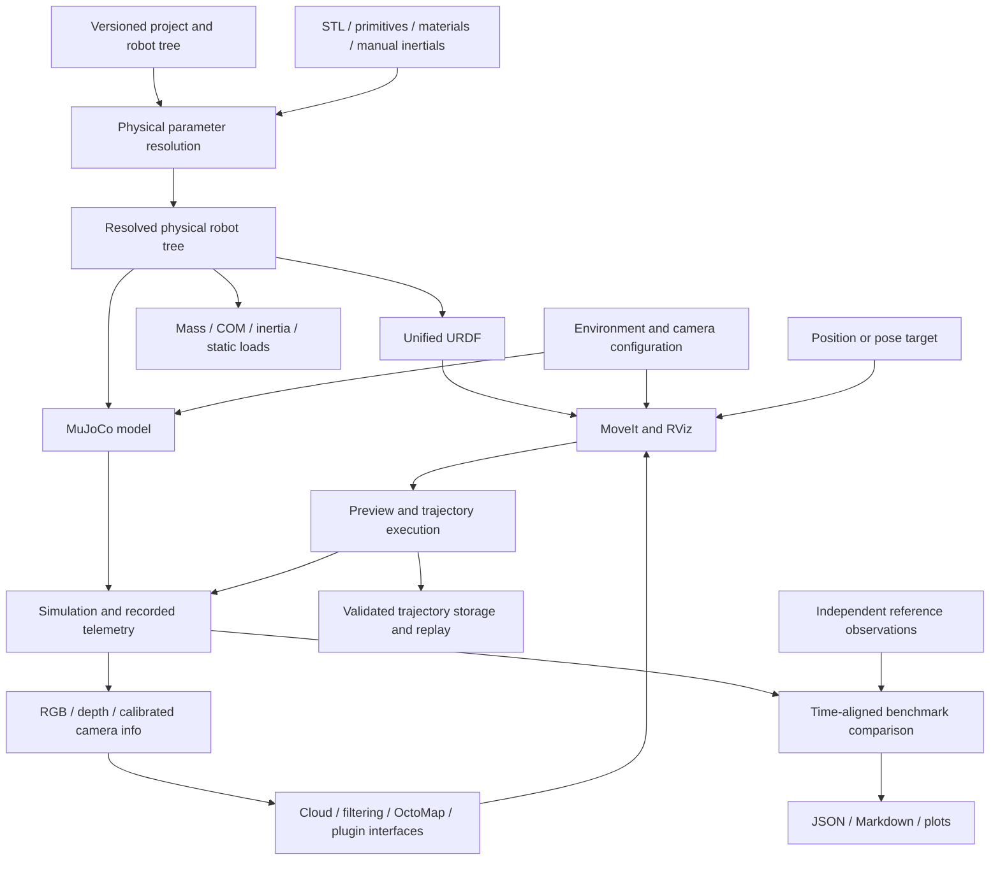

# Extended robot pipeline: architecture and configuration

[Documentation index](README.md) · [Run the pipeline](PIPELINE_WORKFLOW.md)

## Architecture and compatibility

Versioned project manifests compose robot, materials, simulation, MoveIt, world,
sensors, perception, trajectory storage and benchmark configuration. A general
body tree supports fixed/floating roots, branched robots, revolute/continuous/
prismatic joints and multiple named end effectors. The same resolved physical
tree feeds URDF, MuJoCo, static analysis, MoveIt and model-identified records.
The legacy arm YAML remains supported through an explicit adapter; existing
`robot_test`, sizing tools and Gazebo arm commands retain their original inputs.



`ProjectConfig` is an immutable declaration. `resolve_robot` copies and resolves
physical inputs; exporters consume that result. Exported URDF contains the
complete description rather than requiring a duplicate hand-maintained Xacro.
Mesh contents participate in `robot_fingerprint`. Regenerate and relaunch after
configuration changes; editing YAML is not a live model-update protocol.

## Manifest and file layout

Examples live in [`config/pipeline`](../src/arm_lab_model/config/pipeline), separate
from the legacy editor's top-level arm discovery. All new YAML documents require
`schema_version: 1`. Manifest paths resolve relative to the declaring manifest;
mesh paths resolve relative to the robot/environment file owning them.

```yaml
schema_version: 1
robot: robot_ur5e.yaml
simulation: simulation_ur5e.yaml
moveit: moveit_ur5e.yaml
environment: environment.yaml
sensors: sensors.yaml
perception: perception.yaml
benchmark: benchmark_ur5e.yaml
trajectories: trajectories_enabled.yaml
```

Only `schema_version` and `robot` are required in the manifest. Optional files
are loaded only when referenced. Unknown keys/versions, duplicate keys, YAML
aliases, malformed types and nonfinite numbers fail validation. Enabled components
must provide their required fields. Missing measurements remain `null` and are
reported; later operations reject missing inputs they actually require.

| Component | Contract and examples |
|---|---|
| Robot | `format: tree`, identity/source, base, links, joints, end effectors; or `legacy_arm` wrapper |
| Materials | `materials: {name: {density: ..., source: ...}}`; density kg/m³ |
| Simulation | `backend`, `timestep`, `gravity`, `seed`; optional initial positions, bandwidth and error limit |
| MoveIt | Enabled groups, base/tip, solver/controller, scaling, explicit acceleration policies; [planning guide](PIPELINE_PLANNING.md) |
| Environment | Enabled objects, geometry, world pose, static/mass fields; [scene guide](SCENE_PERCEPTION.md) |
| Sensors | Cameras, mount, calibration, rates, clipping/noise; [camera guide](SCENE_PERCEPTION.md) |
| Perception | Clouds, filtering, OctoMap and optional algorithm adapters; [perception guide](SCENE_PERCEPTION.md) |
| Benchmark | Robot/catalogue, optional reference file, metric tolerances; [benchmark guide](TRAJECTORIES_BENCHMARKS.md) |
| Trajectories | `enabled: true`, `directory`; [storage guide](TRAJECTORIES_BENCHMARKS.md) |

The integrated runtime supports MuJoCo. `gazebo` is a recognized configuration
selection but the general pipeline does not provide a Gazebo runtime adapter;
use the existing serial-arm Gazebo workflow for that backend.

## Robot topology and physical contracts

A legacy wrapper references the authoritative arm input without duplicating it:

```yaml
schema_version: 1
format: legacy_arm
source: ../arm_config.yaml
```

A tree requires `schema_version`, `format: tree`, `name`, `family`, `source`,
`base`, `links`, `joints` and `end_effectors`. Here `source` is descriptive
provenance. Names match `[A-Za-z_][A-Za-z0-9_]*`. `base.link` is the unique root;
`base.type` is `fixed` or `floating`. Cycles, disconnected links, duplicate names
and multiple parents fail. Joint coordinate order follows nonfixed list order.

Joint origins use `{xyz, rpy}`: metres and fixed-axis radians relative to the
parent; axes are unit vectors in the joint frame. Moving joints require limits.
Revolute/prismatic joints have lower/upper bounds; continuous joints omit them.
Velocity, acceleration and effort use rad/s, rad/s², N·m for rotary joints or
m/s, m/s², N for prismatic joints. Known positive limits are required by execution;
unknown acceleration can be supplied as a clearly labeled experiment policy.
Fixed joints have no axis or moving limits.

Link inertials can be unknown, complete manual assembly values or automatic
geometry/material calculations. For an STL link:

```yaml
name: example_link
geometry:
  type: mesh
  path: meshes/example_link.stl
  units: mm
  scale: [1, 1, 1]
  origin: {xyz: [0, 0, 0], rpy: [0, 0, 0]}
material: aluminum_6061
inertial: {mode: auto}
```

Manual mode requires mass kg, COM metres, full tensor kg·m² and provenance.
Tensor order is `[ixx, iyy, izz, ixy, ixz, iyz]`, about COM in link axes.
It covers the complete assigned assembly; do not count motors or fittings twice.
Automatic mode integrates a closed homogeneous solid; it cannot recover motors,
hollow internals or variable density from exterior STL surfaces. Read
[physical analysis and exports](PHYSICAL_ROBOT.md) for formulas, overrides,
mesh validation, collision approximations and static/dynamic distinctions.

`project_quadruped_12dof.yaml` remains a topology-only example with unknown
physics. `project_dog12_demo.yaml` instead supplies synthetic physical inputs for
an executable four-leg drop/contact fixture. Twelve actuators plus a floating
base produce 18 velocity and 19 position coordinates. Neither example is a
specific ODG product or a measured commercial dog robot; see [dog demo](DOG12_DEMO.md).

## Benchmark evidence and reproducibility

[`config/benchmarks/ur5e.yaml`](../src/arm_lab_model/config/benchmarks/ur5e.yaml)
records manufacturer references, nominal DH parameters, model properties,
payload/limit provenance and source hashes. Unknown hardware torque and
acceleration data stay unknown. See [UR5e reference](UR5E_REFERENCE.md) for the
model/manufacturer mass discrepancy and approximate collision geometry.

The bundled five FK cases are analytical checks of published nominal kinematics.
They have no timestamps and cannot be used as hardware trajectory recordings.
No real UR5e motion measurements are bundled. Benchmark mode without a compatible
reference emits `incomplete`, even if simulated execution succeeds.

Timed observation files declare robot, scenario, ordered joints, frame, SI units,
evidence and sample times/channels. Simulation and reference must match these
contracts. The engine interpolates overlap but does not guess clock offsets,
reorder joints, transform frames or extrapolate missing samples. Partial coverage
and missing requested channels are incomplete. Joint, TCP, orientation, timing,
effort and absolute mechanical-work metrics use explicitly configured tolerances.
A passing synthetic comparison is never evidence of real-robot agreement.

Archive source configurations, meshes, scenario, calibration/controller/payload
conditions, reference provenance and generated artifacts. Hashes identify inputs;
they do not reconstruct them or independently verify measurement authenticity.

## Implementation stages and verification boundaries

| Stage | Implemented seam | Verification and limits |
|---|---|---|
| 1 | Strict immutable project composition and body tree | Invalid-input and compatibility checks; validation alone is not readiness |
| 2 | UR5e reference catalogue and nominal FK cases | Independent DH consistency and source hashes; no recorded hardware motion |
| 3 | STL/material/manual physical properties and static loads | Known solids, transforms, pendulum/payload equations |
| 4 | Shared URDF/MJCF exports | Inertial/frame preservation, legacy equivalence, floating/prismatic checks |
| 5 | Generated MoveIt configuration and simulation bridge | Actual ROS Humble planning/controller execution |
| 6 | Position/pose targets, preview and execution | Live pose/position requests and unreachable stale-plan rejection |
| 7 | Validated save/replay records | Roundtrip, model/start/limit validation, successful live save |
| 8 | Simulation/MoveIt environment objects | Mesh scaling and collision scene checks; dynamic planning objects rejected |
| 9 | Mounted RGB/depth cameras | Calibrated rendering/unprojection tests; ideal pinhole model |
| 10 | Clouds/filtering/OctoMap configuration and plugins | Analytic cloud tests and ROS adapters; SLAM/learned models are external |
| 11 | Automatic compatible-reference comparison | Known-error and alignment fixtures; no hardware accuracy claim |
| 12 | JSON/Markdown/plots and workflow documentation | Report consistency, optional plot dependencies and documentation checks |

Run `project_check PATH` to inspect configuration only. Its `runtime_ready: false`
means that this command has not established runtime readiness, not that all
pipeline operations are unavailable. Use `robot_pipeline build`, `analyze`,
`reference-check`, `simulate`, `replay` or `compare`, or the ROS pipeline launch,
for subsequent work.
[The workflow](PIPELINE_WORKFLOW.md) gives commands, artifacts and exit meanings.
