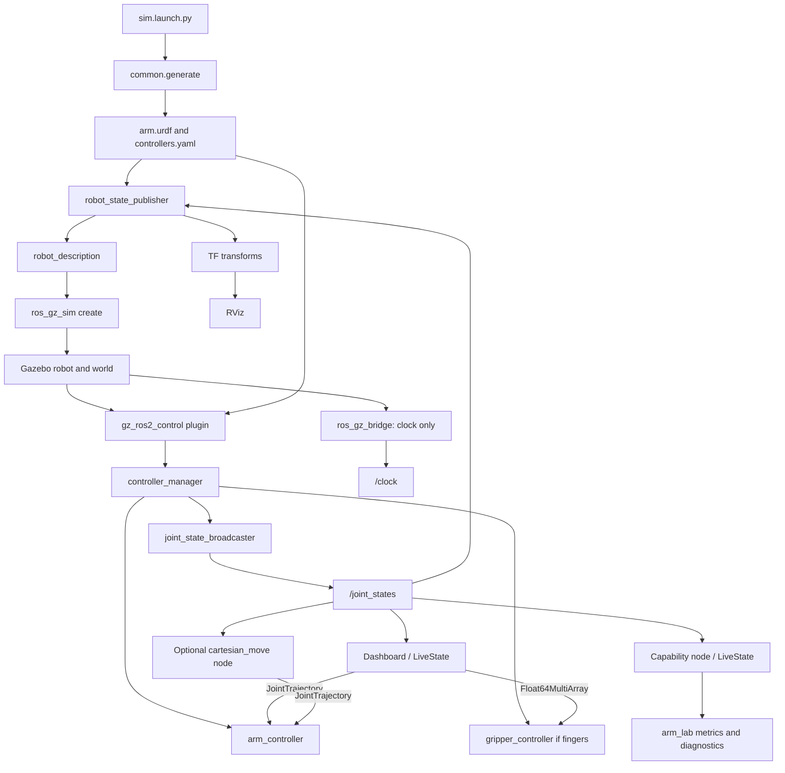

# ROS interfaces and runtime

[Documentation index](README.md) · [Launch arguments](COMMANDS.md)

## Runtime graph

This is the generated ROS/Gazebo system. Optional tools are shown explicitly.
With `simulator:=mujoco`, the `mujoco_sim` node replaces Gazebo, the clock
bridge, the spawner and the controllers. It publishes `/joint_states` and
`/clock`, subscribes to the same trajectory and gripper topics, and serves the
`follow_joint_trajectory` action. The headless `robot_test` benchmarks remain
separate from it.

<!-- AUTO-GENERATED: diagram:ros-runtime -->



<!-- END AUTO-GENERATED -->

## Startup sequence

`sim.launch.py` resolves YAML and overrides, generates controller YAML and URDF,
optionally patches world gravity, starts Gazebo, publishes the description and
requests spawning. Event handlers start the joint-state broadcaster after the
spawn process exits, then the arm controller, then the optional gripper controller.
In velocity mode, a spare raw-velocity controller is also loaded inactive.

These handlers respond to process exit, not a check that the preceding stage
succeeded. If spawning fails, later spawners can still start and time out. Inspect
the first error and controller state; opening a window is not proof of readiness.

`view.launch.py` starts state publication, joint sliders and RViz without Gazebo.
`dashboard.launch.py` attaches GUI/analysis nodes to an existing joint-state stream.
The latter must receive the same config, payload, tool mass and gravity as the
simulation being observed.

## Controllers and interfaces

| Controller | Purpose | Condition |
|---|---|---|
| `joint_state_broadcaster` | Publishes joint positions, velocities and available efforts | Simulation startup |
| `arm_controller` | JointTrajectoryController, with position/velocity state interfaces | Always generated |
| `gripper_controller` | JointGroupEffortController for force grasp mode; otherwise JointGroupPositionController | Finger joints enabled |
| `arm_velocity_controller` | JointGroupVelocityController for direct speed commands | Generated only for velocity mode; starts inactive |

The arm command interface is `position`, `velocity` or `effort`, selected from
the config or launch override. Gains are generated from `control.gains`; those
are not the MuJoCo benchmark gains. Ideal position commands are useful for
geometry inspection but do not demonstrate actuator torque capacity.

## Topics

Names below are the defaults; controller-related names change with the node's
controller parameters. The current launch uses global names, so multiple robots
need additional namespacing/remapping work.

| Topic | Message | Producer → consumer / units |
|---|---|---|
| `/joint_states` | `sensor_msgs/msg/JointState` | Broadcaster → state publisher, dashboard, capability and motion tools |
| `/clock` | `rosgraph_msgs/msg/Clock` | Gazebo clock bridge → ROS simulation-time consumers |
| `/arm_controller/joint_trajectory` | `trajectory_msgs/msg/JointTrajectory` | Dashboard/Cartesian/pick-place/speed tools → arm controller; rad and rad/s |
| `/gripper_controller/commands` | `std_msgs/msg/Float64MultiArray` | Dashboard/pick-place → gripper; force-mode effort or position-mode opening values |
| `/arm_lab/cartesian_target` | `geometry_msgs/msg/PoseStamped` | User → optional Cartesian node; model world coordinates in metres |
| `/arm_lab/cartesian_plan` | `std_msgs/msg/String` | Cartesian node → planner summary or failure text |
| `/arm_lab/workspace` | `visualization_msgs/msg/MarkerArray` | Workspace marker node → RViz |
| `/arm_lab/objects` | `visualization_msgs/msg/MarkerArray` | `mujoco_sim` → RViz; the world's sample boxes where MuJoCo has them |
| `/arm_lab/tcp_speed` | `std_msgs/msg/Float64` | Capability publisher; m/s |
| `/arm_lab/payload_capacity` | `std_msgs/msg/Float64` | Capability publisher; kg, static model estimate |
| `/arm_lab/torque_utilisation` | `std_msgs/msg/Float64` | Capability publisher; maximum joint ratio, 1 means 100% |
| `/arm_lab/tcp_droop` | `std_msgs/msg/Float64` | Capability publisher; m, structural/compliance estimate |
| `/arm_lab/reach` | `std_msgs/msg/Float64` | Capability publisher; m from configured reach origin |
| `/arm_lab/power` | `std_msgs/msg/Float64` | Capability publisher; W, modeled draw |
| `/arm_lab/joint_torque_model` | `std_msgs/msg/Float64MultiArray` | Capability publisher; N·m in `cfg.joint_names` order |
| `/diagnostics` | `diagnostic_msgs/msg/DiagnosticArray` | Capability publisher; speed/torque/droop status and values |

The Cartesian target node does not transform `header.frame_id` through TF.
Supply coordinates in the analytical model's world frame. An all-zero orientation
quaternion selects the node's tool-down fallback; specify a valid quaternion
when orientation matters. The node publishes trajectories on a topic, not a
custom action interface that confirms completion.

## Node parameters

| Executable | Important parameters |
|---|---|
| `dashboard` | `config_file`, `ee_mass`, `gravity`, `payload_mass`, `arm_controller`, `gripper_controller` |
| `capability_node` | `config_file`, `ee_mass`, `gravity`, `payload_mass`, `publish_rate` (20 Hz by default) |
| `cartesian_move` | `config_file`, `speed`, `accel`, `arm_controller`; nonpositive speed/accel select motion-config values |
| `speed_test` | `config_file`, `payload_mass`, `target_speed`, `cycles`, `pose_a`, `pose_b`, `arm_controller` |
| `pick_place` | `config_file`, object/place coordinates, mass/size, approach height, speed, controllers, `dry_run`, grip/open force |
| `workspace_markers` | `map_file`, `frame_id`, `revolutions`, `publish_period` |
| `mujoco_sim` | `config_file`, `ee_mass`, `gravity`, `payload_mass`, `initial_pose`, `world`, `gui`, `real_time_factor`, `publish_rate`, `bandwidth_hz`, `arm_controller`, `gripper_controller` |

Use `--ros-args -p name:=value` for node parameters. Core launch nodes are passed
`use_sim_time`; pass it explicitly to manually launched motion nodes when
operating with a simulated clock.

```bash
ros2 run arm_lab_gui speed_test --ros-args \
  -p config_file:="$PWD/my_arm.yaml" -p use_sim_time:=true \
  -p target_speed:=0.2 -p cycles:=4
ros2 run arm_lab_kinematics cartesian_move --ros-args \
  -p config_file:="$PWD/my_arm.yaml" -p use_sim_time:=true
```

## Live estimates versus physical state

`LiveState` matches joint names to config order and estimates acceleration using
filtered finite differences of reported velocity. It retains the simulator's
effort values separately, but capability torque/utilization is derived from
`ArmModel.inverse_dynamics`. Missing/stale joint messages are not a calibrated
torque measurement. Diagnostics indicate model-budget breaches; they do not
implement an emergency stop or hardware safety function.

The dashboard's payload spinner changes analysis only. Attach a physical test
load using `payload_mass:=...` at simulation launch. Match both values before
comparing results. Similarly, pass `gravity:=...` to patch the Gazebo world;
the YAML gravity value alone changes the model but does not patch the world.

Source: [simulation launch](../src/arm_lab_bringup/launch/sim.launch.py),
[controller generation](../src/arm_lab_model/arm_lab_model/controllers_builder.py),
[capability node](../src/arm_lab_gui/arm_lab_gui/capability_node.py),
[Cartesian node](../src/arm_lab_kinematics/arm_lab_kinematics/cartesian_node.py).
